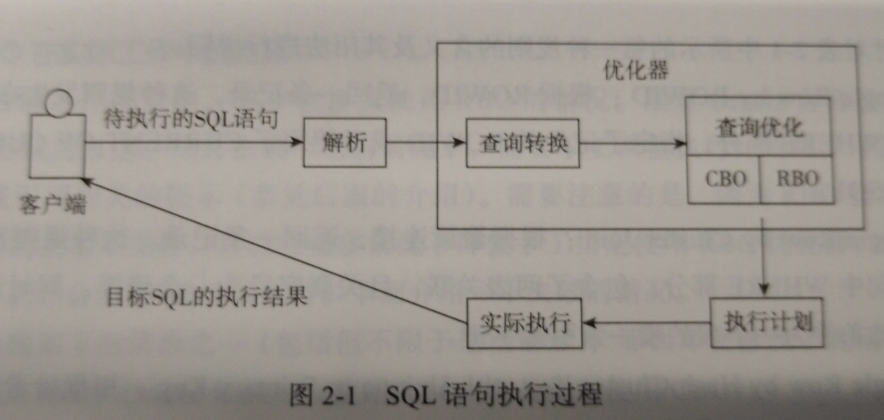

# 数据库高效优化

### 第一章 入门

##### 案例一：关联表查询 

使用关联查询时，不能没有任何限制条件的连接查询

```sql
错误示例：
SELECT ...
FROM xxx A1,xxx A2
WHERE A1.xx = XXX AND A2.xxx >= xxx
```

##### 案例二：between and >= <=

查询时，应该使用封闭区间查询，避免全表扫描

这2种都是全闭区间，左右都包含

注意日期 如果不加时分秒，则右日期后默认追加的是00:00:00,应该需要手动添加时分秒为23:59:59才能正确的获取右区间的信息。

##### 案例三：规范sql(oracle)

调整代码中format格式，与数据库中的数据相同，可以提高效率

##### 案例四：大量数据检索

索引数据统计信息异常，需要重新构建索引（索引优化）

##### 案例五：count(*)

不同索引类型，使用count(*)统计时所花费的时间不同。

如果不需要数据，位图索引最快，可以加上并行。

但是实际中无法使用与OLTP类型数据库（面向交易的处理过程）

##### 案例六：索引问题

本地分区索引维护成本很低，全局索引维护成本较高

### 第二章 优化器与成本

##### 2.1 优化器



RBO：基于规则的优化

CBO：基于代价（成本）的优化方式

CBO存在问题：

* 多列关联关系
* sql无关性
* 直方图统计信息
* 复杂多表关联


##### 2.2 成本

oracle绝大多数情况下是使用CBO优化器对sql语句制定执行计划的。

```
成本 语句的预计执行时间的总和，以单数据块读取时间单元的形式来表示。  
花费在单数据块读取上的时间，加上花费在多数据块上读取的时间，再加上CPU处理时间，然后将总和除以单数据块读取所花费时间。

```

### 第三章 执行计划

##### 3.1 概述

```
什么是执行计划?
数据库执行sql语句是按照一定顺序，分步骤完成的。由优化器决定的。优化器确定这一系列的顺序，步骤就被称为执行计划。
```


